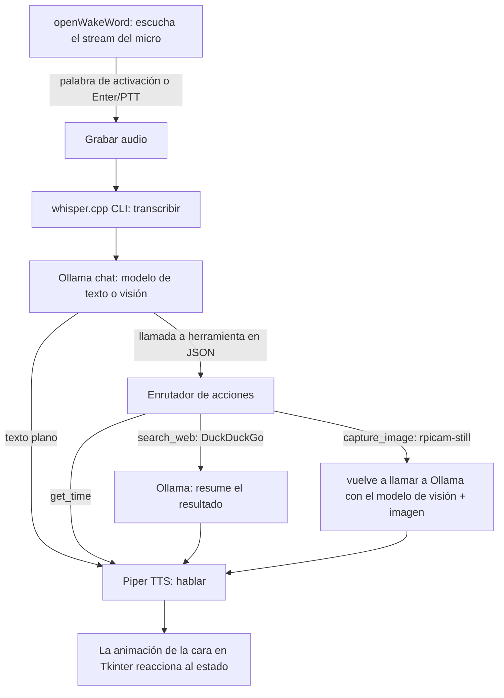

# Recorrido por el Código

Todo vive en un único archivo, `agent.py` (~1080 líneas), más los recursos
estáticos (`faces/`, `sounds/`), un archivo de configuración (`config.json`)
y un modelo de palabra de activación (`wakeword.onnx`). No hay ningún
`whisper.cpp/` ni `piper/` en el repositorio — son herramientas externas que
el script invoca por línea de comandos (ver
[02-whats-missing.md](02-whats-missing.md)).

## Arquitectura general



Todo el sistema es una **máquina de estados** (`BotStates`: `IDLE`,
`LISTENING`, `THINKING`, `SPEAKING`, `ERROR`, `CAPTURING`, `WARMUP`).
`set_state()` actualiza `self.current_state`, que determina de qué carpeta
de PNGs de la cara tira `update_animation()`, mediante un temporizador
`after()` de Tkinter (50ms mientras habla, 500ms el resto del tiempo, para
simular el movimiento de la boca).

## Modelo de hilos (threading)

- **Hilo principal**: el bucle de eventos de Tkinter (`root.mainloop()`).
  Es el dueño de todas las actualizaciones de la interfaz — cualquier hilo
  en segundo plano que necesite tocar un widget programa el cambio vía
  `self.master.after(0, fn)` en lugar de tocar Tk directamente (Tkinter no
  es thread-safe).
- **Hilo `safe_main_execution`**: se inicia una vez desde `__init__` y
  ejecuta para siempre el bucle completo de palabra de activación → grabar
  → transcribir → chatear → llamar a herramientas.
- **Hilo `_tts_worker`**: saca frases de `tts_queue` y las va hablando de
  una en una, de modo que el bot puede empezar a hablar en cuanto termina
  la *primera* frase de una respuesta del LLM en streaming, sin esperar a
  la respuesta completa.
- **Hilo `_run_thinking_sound_loop`**: se lanza en cada turno mientras
  `thinking_sound_active` está activo, y repite un sonido aleatorio de
  "pensando" (`checking_banks.wav`, `computing.wav`, ...) hasta que el LLM
  empieza a producir salida real.

La coordinación entre hilos se hace con simples `threading.Event`
(`ptt_event`, `recording_active`, `interrupted`, `tts_active`,
`thinking_sound_active`) — no hay más locks que un único `tts_queue_lock`
que protege la lista de la cola de TTS.

## Configuración (`config.json` / `DEFAULT_CONFIG`)

`load_config()` fusiona `config.json` sobre `DEFAULT_CONFIG`
(agent.py:62-91). Campos:

| Campo | Propósito |
|---|---|
| `text_model` | Modelo de Ollama para el chat de texto normal (por defecto `gemma3:1b`) |
| `vision_model` | Modelo de Ollama usado cuando se adjunta una imagen (por defecto `moondream`) |
| `voice_model` | Ruta a una voz `.onnx` de Piper |
| `chat_memory` | Presente en la config pero **no se lee en ningún sitio** de agent.py — la persistencia de memoria ocurre siempre, incondicionalmente |
| `camera_rotation` | Grados de rotación aplicados a la salida de `rpicam-still` |
| `system_prompt_extras` | Se añade al final del system prompt base |
| `input_device` | Override de nombre/índice del micro; `None` = el predeterminado del sistema |
| `input_sample_rate` | Sample rate preferido del micro; se autodetecta si no se especifica |

El system prompt (`BASE_SYSTEM_PROMPT`, agent.py:169-192) le enseña al
modelo a responder o bien en texto plano (para ser hablado) o bien con un
objeto JSON en crudo como `{"action": "get_time"}` para invocar una
herramienta. Hay un **segundo** system prompt, casi duplicado, al principio
de `config.json` (la clave `system_prompt`) — `agent.py` nunca lee
`config["system_prompt"]`, solo `system_prompt_extras`, así que esa clave
en `config.json` es actualmente peso muerto / solo documentación.

## Pipeline de entrada de audio

- `resolve_input_device()` convierte `input_device` (nombre, índice o
  `null`) en un índice de dispositivo de sounddevice, usando el
  predeterminado del sistema operativo si falla.
- `choose_input_samplerate()` sondea el sample rate nativo del dispositivo
  y luego prueba `48000 → 44100 → 32000 → 16000` hasta que
  `sd.check_input_settings` acepta uno — los micrófonos USB en la Pi son
  poco consistentes con qué sample rates aceptan.
- **Ruta de la palabra de activación** (`detect_wake_word_or_ptt` →
  `_listen_loop`): transmite el audio del micro en fragmentos de 1280
  muestras (80ms) a 16kHz (el sample rate que espera openWakeWord); si el
  sample rate nativo del micro es distinto, resamplea mediante un simple
  slicing por vecino más cercano en vez de `scipy.signal.resample`,
  explícitamente para ahorrar CPU en la Pi. Los fragmentos se pasan a
  `oww_model.predict()`, y se dispara en cuanto la puntuación de algún
  modelo supera `WAKE_WORD_THRESHOLD` (0.5). Pulsar Enter o enviar una
  línea por stdin también corta la escucha de inmediato
  (`StopIteration("PTT")` / `("CLI")`), y si el modelo de palabra de
  activación no llegó a cargarse, este bucle se salta por completo y
  "Enter para hablar" pasa a ser el único disparador.
- **Grabación**: `record_voice_adaptive()` se detiene sola tras ~1.5s de
  silencio (basado en RMS) o un tope de 30s; `record_voice_ptt()` graba
  mientras el toggle de Enter mantenga activo `recording_active`. Ambas
  escriben un WAV mono de 16 bits vía `save_audio_buffer()`.

## Voz a texto (speech-to-text)

`transcribe_audio()` invoca por subprocess (agent.py:774-791):

```
./whisper.cpp/build/bin/whisper-cli -m ./whisper.cpp/models/ggml-base.en.bin -l en -t 4 -f input.wav
```

y parsea la última línea no vacía de stdout, quitando el prefijo
`[timestamp]` que imprime whisper.cpp. **Ni el binario ni el archivo del
modelo existen en ningún sitio de este repo ni en `setup.sh`** — ver
[02-whats-missing.md](02-whats-missing.md), punto 1.

## Chat + llamadas a herramientas

`chat_and_respond()` (agent.py:811-943) es el bucle central:

1. Trata como caso especial `"forget everything"` / `"reset memory"` para
   borrar el historial de chat sin tocar el LLM.
2. Transmite `ollama.chat(...)` token a token. En el instante en que un
   fragmento contiene `{"` o el texto literal `action:`, entra en
   `is_action_mode` y deja de enviar texto a pantalla/TTS — ahora está
   almacenando en buffer una llamada a herramienta.
3. Si **no** está en modo acción, cada signo de puntuación de fin de
   frase (`. ! ? \n`) vuelca la frase acumulada en `tts_queue`, así que el
   habla arranca a mitad de la respuesta.
4. Si está en modo acción, `extract_json_from_text()` extrae con una
   regex el primer bloque `{...}` y se lo pasa a
   `execute_action_and_get_result()` (agent.py:445-511), que normaliza
   alias (`"google"` → `search_web`, `"look"`/`"see"` → `capture_image`,
   etc.) y despacha:
   - `get_time` → formatea `datetime.now()` localmente, sin ida y vuelta
     al LLM.
   - `search_web` → búsqueda de noticias en DuckDuckGo, con fallback a
     búsqueda de texto, vía `duckduckgo_search.DDGS`.
   - `capture_image` → devuelve un valor centinela que dispara
     `capture_image()` (invoca `rpicam-still`) y **recursa** en
     `chat_and_respond()` con la foto adjunta, cambiando a
     `vision_model`.
5. Los resultados de herramientas no triviales (resultados de búsqueda,
   ruta de la cámara) se reenvían mediante una segunda llamada a
   `ollama.chat()`, esta vez sin streaming, cuyo system prompt es
   simplemente "resume esto en una frase corta" — ese resumen es lo que se
   acaba hablando, no el resultado crudo de la herramienta.

La memoria de la conversación son dos listas: `permanent_memory` (cargada
desde/guardada en `memory.json`, acotada al mensaje de sistema + los
últimos 10 turnos en `save_chat_history()`) y `session_memory` (solo de
esta ejecución, no se persiste durante la sesión). Ambas se concatenan
como contexto en cada turno.

## Texto a voz (text-to-speech)

`speak()` (agent.py:962-1020) envía el texto limpio a través de una tubería
(pipe) a:

```
./piper/piper --model <voice_model> --output-raw
```

y transmite el PCM crudo que sale por stdout de Piper directamente a un
`sounddevice.RawOutputStream`, resampleando al vuelo con
`scipy.signal.resample` si el dispositivo de salida no acepta los 22050 Hz
nativos de Piper. Se comprueba `interrupted.is_set()` durante el streaming,
así que pulsar Espacio durante la reproducción
(`handle_speaking_interrupt`) corta el audio de inmediato.

## Cámara / visión

`capture_image()` invoca `rpicam-still` (la CLI de cámara actual de la Pi,
basada en libcamera, que sustituye a la antigua `raspistill`), rota
opcionalmente el JPEG con Pillow según `camera_rotation`, y devuelve la
ruta del archivo, que vuelve a `chat_and_respond(..., img_path=...)` para
adjuntarse a la siguiente llamada al modelo de visión de Ollama.

## Recursos (assets)

- `faces/<estado>/*.png` — una carpeta por cada valor de `BotStates`,
  ordenadas alfabéticamente y reproducidas en bucle; si una carpeta está
  vacía, se recurre a un fotograma azul sólido en vez de fallar.
- `sounds/{greeting,ack,thinking}_sounds/*.wav` — se elige uno al azar en
  cada ocasión. `sounds/error_sounds/` existe en disco (creada por
  `setup.sh`) pero nada en `agent.py` reproduce nunca nada de ahí — ver
  [02-whats-missing.md](02-whats-missing.md), punto 4.

## Apagado

`atexit.register(self.safe_exit)`, junto con el enlace de `<Escape>` y el
botón "Exit & Save", canalizan todo hacia `safe_exit()`: detiene cualquier
audio en curso, limpia todos los eventos de threading, guarda el historial
de chat, le dice a Ollama que descargue el modelo de memoria
(`keep_alive=0`) para que no se quede ocupando RAM tras cerrar la app,
detiene sounddevice, y cierra Tk.
